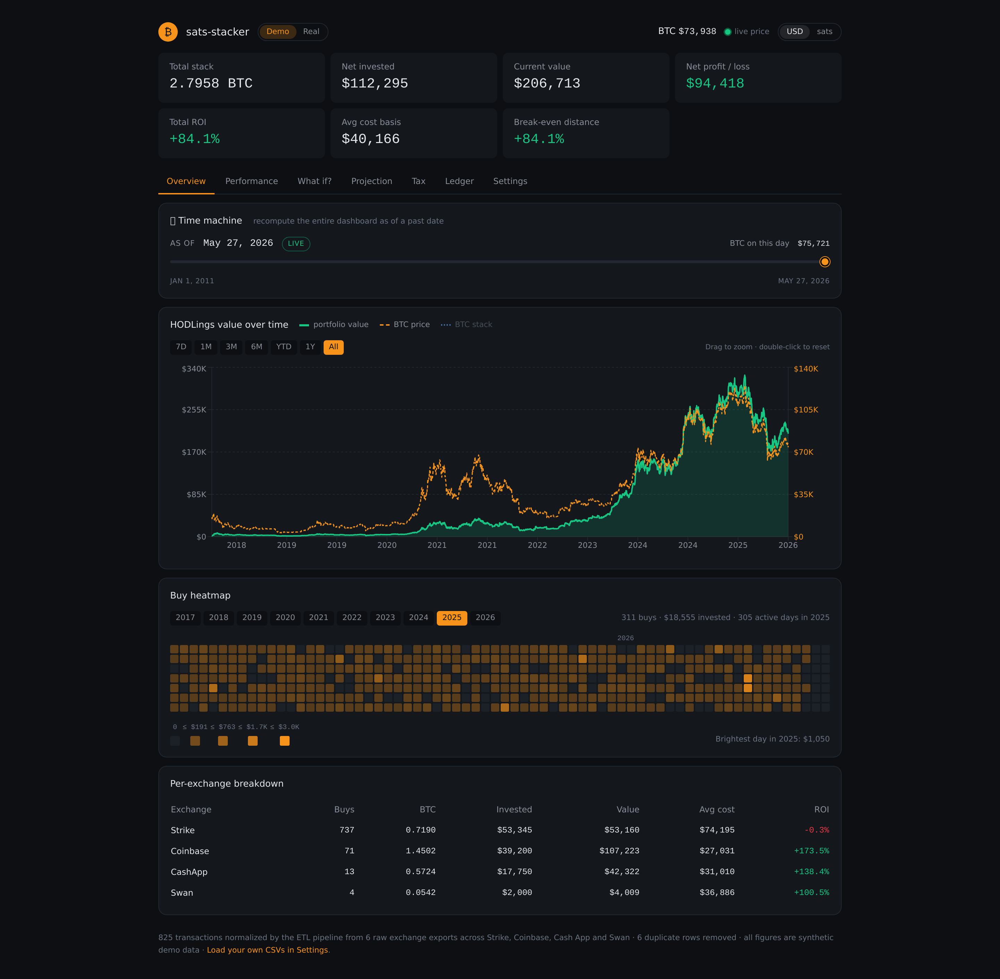
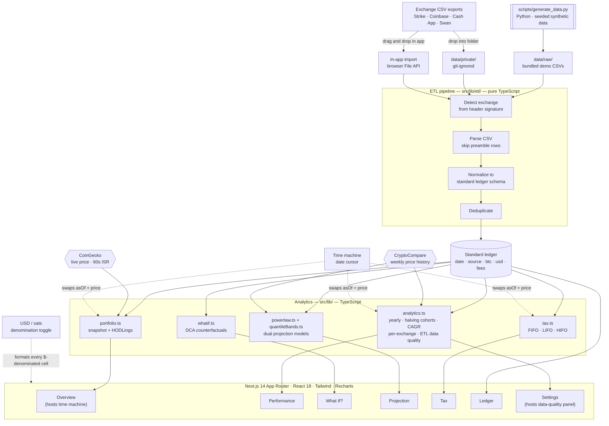
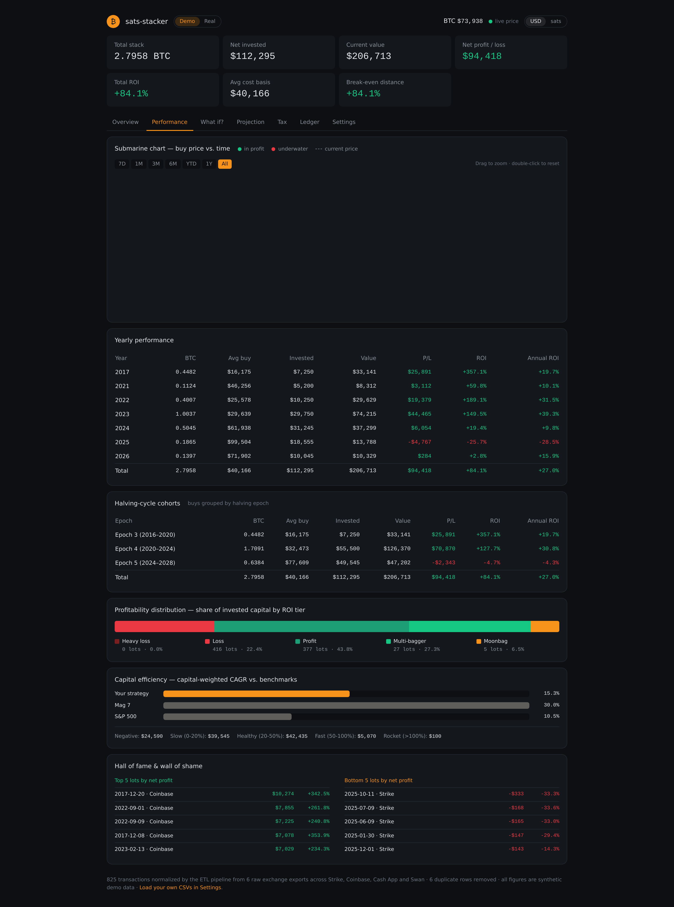
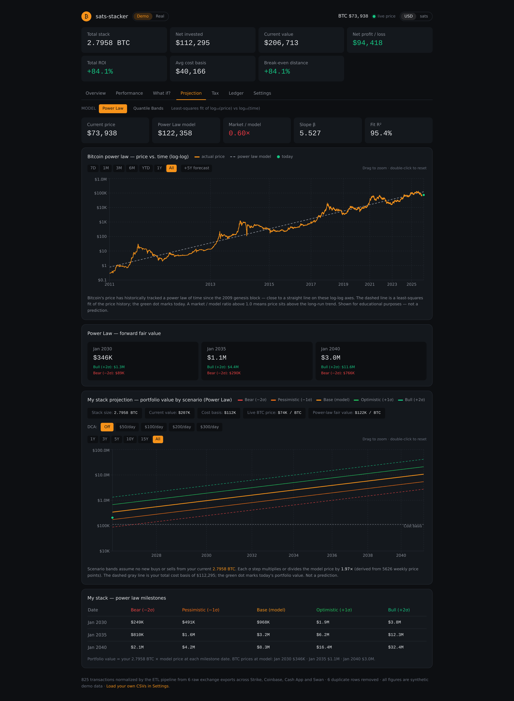
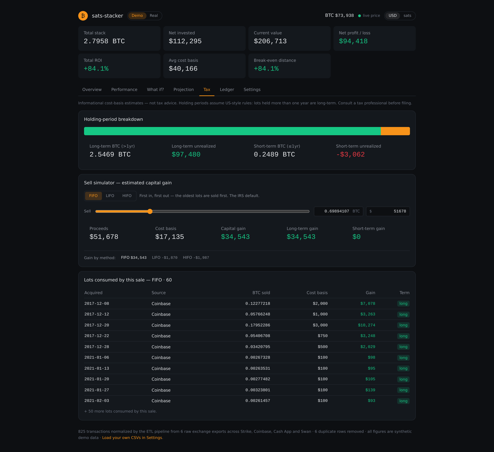
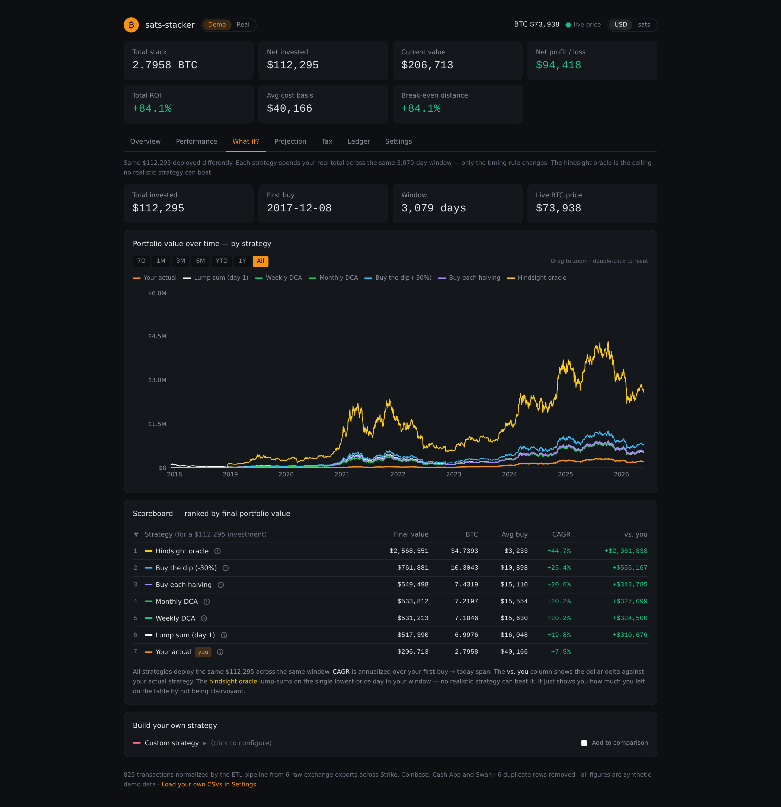

<div align="center">

# ₿ sats-stacker

**A dark-themed Bitcoin DCA portfolio analyzer.**

Cost basis, ROI, capital efficiency, dual-model BTC price projections (Power Law and asymmetric Quantile Bands), and cost-basis tax estimates — across every exchange you've stacked on.


[](https://vercel.com/new/clone?repository-url=https%3A%2F%2Fgithub.com%2Fellokojavi%2Fsats-stacker)

</div>



---

## Overview

sats-stacker turns a pile of exchange CSV exports into a single portfolio dashboard.

It started life as a Jupyter notebook that merged Bitcoin transaction history from **Strike, Coinbase, Cash App, and Swan**, normalized four different CSV schemas into one ledger, and computed cost basis, ROI, and CAGR. This repository rebuilds that analysis as a fast, shareable web app — with tabbed reports, a Projection view that toggles between the Bitcoin Power Law and an asymmetric Quantile Bands model, and a cost-basis tax engine.

## How it works

Every exchange exports its history in a different, slightly messy CSV format:

- **Coinbase** prepends account-info rows before the real header
- **Cash App** quotes every field and writes amounts like `-$1,000.00` (commas and all)
- **Swan** leads with a company-info header
- **Strike** interleaves deposit and send rows among the actual purchases

The ETL pipeline in `src/lib/etl/` auto-detects each file's exchange from its header, finds the real header past any preamble, normalizes all four schemas onto one standard ledger (`date, source, btc, usd, fees`), removes duplicate rows, and hands the result to the dashboard. The core is pure TypeScript with no filesystem dependency, so the **exact same pipeline runs at build time over the bundled data and in your browser over files you import.**

## Architecture



CSVs from the four exchanges (or the seeded Python generator) feed a single TypeScript ETL pipeline that produces one canonical ledger. Five `src/lib/` modules read from that ledger, two external APIs supply live and historical prices, and seven dashboard tabs render the result. Two cross-cutting controls — the **time-machine cursor** (swaps the `(price, asOf)` inputs the analytics see) and the **USD/sats denomination toggle** (flips how every dollar figure is formatted) — wrap the whole thing.

## Demo and Real modes

A **Demo / Real** toggle in the header switches between synthetic data (shareable, works out of the box) and your own holdings. Switch to Real with no data loaded and the app walks you through importing your first CSVs.

Two ways to load real data, and you can mix exports from all four exchanges:

- **In-app import** — drop your exports into the import zone. They're parsed in your browser and remembered on this device.
- **Local folder** — drop CSVs into `data/private/` (any layout). The app loads them on startup.

Both keep real data out of the repo: `data/private/` is git-ignored, the browser import never writes to disk, and `.gitignore` blocks common real-export filenames. `scripts/generate_data.py` writes the synthetic demo CSVs in each exchange's native format — **the repository contains no real financial data.**

## What it shows

Reports are organized into six tabs, with the headline KPIs pinned above them:

- **Overview** — a **time machine** (drag a date cursor and watch every KPI, table, and chart recompute as of that day — every analytic is a pure function of `(transactions, price, asOf)`, and the slider just swaps the latter two), portfolio value over time with a clickable legend that toggles each curve and its Y-axis (portfolio value, BTC price, and a BTC-denominated stack-size overlay that shares the right axis with BTC price), a buy-density heatmap, and the per-exchange breakdown
- **Performance** — submarine chart, yearly performance with capital-weighted annualized ROI, a **halving-cycle cohort view** (buys grouped by Bitcoin's halving epochs, the cycle-defining events of the network), profitability distribution, capital-weighted CAGR vs. benchmarks, hall of fame & wall of shame
- **What If?** — compares your actual DCA against five counterfactual strategies (lump-sum, weekly, monthly, quarterly, and annual buys anchored to your first purchase date), with an interactive scoreboard and per-strategy info tooltips. A **custom strategy builder** lets you compose your own rule (cadence in days + optional drawdown-triggered bonus buys with a configurable weight) and drop it straight into the chart and scoreboard — same capital constraint as every built-in strategy
- **Projection** — current price against Bitcoin's historical trend on log-log axes (real prices from CryptoCompare), with a top-of-tab **model toggle** that swaps between two trajectory models without recomputing the rest of the dashboard:
  - **Power Law** — a least-squares fit of log₁₀(price) vs log₁₀(time), with slope β, R², and ±1σ / ±2σ scenario bands derived from the log residuals.
  - **Quantile Bands** — Cowen (2026)'s asymmetric quadratic quantile regression, with the seven conditional quantiles rearranged for monotonicity (Chernozhukov, Fernández-Val & Galichon 2010) and the inner five (Q10–Q95) plotted as bear/pessimistic/base/optimistic/bull. Encodes a tighter upper-tail ceiling than the linear power law.

  Both models share the same UI surface: model "fair value", market/model multiplier, forward fair-value milestones, a holdings projection chart, and a DCA overlay of your own stacking pace. Charts support date-range zoom with presets and drag selection, plus a +5-year forecast extension on the historical chart.
- **Tax** — holding-period breakdown plus an interactive sell simulator: FIFO / LIFO / HIFO cost-basis lot matching with editable BTC quantity and USD proceeds inputs, and estimated capital gain with short-/long-term split
- **Ledger** — the full sortable, paginated transactions table

**Settings tab** also hosts an **ETL data-quality panel** that cross-checks every transaction's implied $/BTC against the bundled BTC price history for that day and flags anomalies — a fee leak rolled into the principal column, a normalizer mis-mapping a field, that kind of thing. The ETL story isn't just "we transformed" — it's "we transformed *and verified*."

**USD / sats denomination toggle** — a header switch flips every dollar-denominated KPI, table, and BTC quantity on the dashboard between US dollars and satoshis (1 BTC = 100,000,000 sats). $/BTC exchange rates stay in USD; everything else respects the toggle.

**Live BTC price** — fetched server-side at page render (60-second ISR cache) so headline numbers are correct on first load with no flicker. A background client-side poll refreshes every 60 seconds, so charts and tables stay current during long sessions. A pulsing price chip in the header links directly to CoinGecko.

## Screenshots

All shots are captured against the bundled synthetic dataset — never real holdings. Regen with `npm run screenshots` (see [`docs/screenshots/`](docs/screenshots/)).

<table>
  <tr>
    <td width="50%" valign="top">
      <b>Performance</b><br />
      <sub>Submarine chart, yearly + halving-cycle cohorts, profitability distribution, capital-weighted CAGR vs. benchmarks.</sub><br /><br />
      <a href="docs/screenshots/02-performance.png"></a>
    </td>
    <td width="50%" valign="top">
      <b>Projection</b><br />
      <sub>Toggle between the Power Law (log-log fit, β / R², ±σ bands) and Quantile Bands (Cowen 2026 asymmetric quadratic, Q10–Q95) models. Same chart, same forward bands, same DCA-pace overlay.</sub><br /><br />
      <a href="docs/screenshots/03-projection.png"></a>
    </td>
  </tr>
  <tr>
    <td width="50%" valign="top">
      <b>Tax</b><br />
      <sub>Holding-period breakdown plus a FIFO / LIFO / HIFO sell simulator with editable inputs and short/long-term gain split.</sub><br /><br />
      <a href="docs/screenshots/04-tax.png"></a>
    </td>
    <td width="50%" valign="top">
      <b>What If?</b><br />
      <sub>Your actual DCA vs. five counterfactual strategies — lump-sum, weekly, monthly, quarterly, and halving-anchored buys.</sub><br /><br />
      <a href="docs/screenshots/05-whatif.png"></a>
    </td>
  </tr>
</table>

## Tech stack

- **Next.js 14** (App Router) and **React 18**
- **TypeScript**
- **Tailwind CSS** for the dark dashboard theme
- **Recharts** for charts
- **Vitest** for unit tests
- **Python** (standard library only) for the synthetic-data generator

## Getting started

### Deploy your own copy

The fastest way to see it running is to click **[Deploy with Vercel](https://vercel.com/new/clone?repository-url=https%3A%2F%2Fgithub.com%2Fellokojavi%2Fsats-stacker)** — Vercel forks the repo into your account and ships a live URL in about a minute. The repo is preconfigured for zero-touch deployment (see [`docs/DEPLOY.md`](docs/DEPLOY.md)).

### Prerequisites (for running locally)

- Node.js 18.18 or newer, and npm
- Python 3.9+ — only needed if you want to regenerate the demo data

### Run it locally

```bash
git clone https://github.com/ellokojavi/sats-stacker.git
cd sats-stacker
npm install
npm run dev
```

Then open <http://localhost:3000>.

### Run the tests

```bash
npm test
```

The cost-basis tax engine (FIFO / LIFO / HIFO lot matching) is covered by a Vitest suite.

### Regenerate the demo data (optional)

```bash
python scripts/generate_data.py
```

The generator is seeded, so every run produces the same exports.

## Project structure

```
sats-stacker/
├── data/
│   ├── raw/                    synthetic exchange exports, native formats
│   │   └── Strike/ Coinbase/ CashApp/ Swan/
│   ├── private/                drop your real exports here (git-ignored)
│   └── btc_price_history.json  weekly BTC price series (2011-present)
├── docs/
│   └── screenshots/            README hero + per-tab screenshots
├── scripts/
│   ├── generate_data.py        deterministic synthetic-export generator
│   └── capture_screenshots.mjs Playwright capture for docs/screenshots/
├── src/
│   ├── app/                    Next.js App Router — dashboard + /price route
│   ├── components/             dashboard, tabs, panels, charts, tables, import
│   └── lib/
│       ├── etl/                CSV parser, exchange normalizers, pipeline
│       ├── analytics.ts        lots, yearly, halving cohorts, profitability,
│       │                       CAGR, per-exchange, ETL data-quality checks
│       ├── projection.ts       shared BtcProjection contract (both models)
│       ├── powerlaw.ts         power-law least-squares fit
│       ├── quantileBands.ts    Cowen 2026 asymmetric quadratic quantile model
│       ├── tax.ts              FIFO/LIFO/HIFO cost-basis engine
│       ├── tax.test.ts         Vitest unit tests for the tax engine
│       ├── portfolio.ts        snapshot + holdings-series metrics
│       ├── data.ts             filesystem loaders (demo / private)
│       ├── importStore.ts      browser-import localStorage persistence
│       ├── unit.tsx            USD/sats denomination context
│       ├── format.ts           number / date / unit-aware formatting
│       └── types.ts            shared types
├── tailwind.config.ts
└── package.json
```

## Roadmap

sats-stacker was built in phases.

- [x] **Phase 1 — Foundation**: ETL pipeline, synthetic-data generator, portfolio snapshot, HODLings chart
- [x] **Phase 2 — Analytics**: submarine chart, yearly performance, per-exchange breakdown, profitability distribution, CAGR vs. benchmarks, transactions table, live price feed
- [x] **Power Law & tabs**: Bitcoin power-law analysis on log-log axes, tabbed reports, dedicated live-price page
- [x] **Phase 3 — Tax**: cost-basis lot tracking (FIFO / LIFO / HIFO) with a sell simulator, capital-gains estimates, and unit tests
- [x] **Phase 4 — Polish & What If?**: What If? strategy comparator, date-range zoom with presets, power-law holdings projections (bear/base/bull bands), real BTC price history from CryptoCompare, editable tax inputs, clickable chart legends, capital-weighted annualized ROI, server-side price fetch with 60-second auto-refresh
- [x] **Phase 6 — Domain depth & shareability**: time-machine date cursor (drag a date and watch every analytic recompute as of that day), halving-cycle cohort view (buys grouped by Bitcoin halving epochs), USD/sats denomination toggle in the header, and an ETL data-quality panel that cross-checks every transaction's implied $/BTC against the bundled price history and flags anomalies. *(Phase 5 — fees, realized P/L, risk panel, goals — is planned but not yet shipped; tracked in `docs/`.)*
- [x] **Phase 7 — Distribution**: Vercel-ready Next.js config (`outputFileTracingIncludes` ships the bundled CSVs and price history into the serverless function) plus a "Deploy with Vercel" button in the README hero that forks the repo into the reviewer's account in one click. See [`docs/DEPLOY.md`](docs/DEPLOY.md) for the walkthrough.
- [x] **Phase 8 — Custom strategy builder**: a sixth slot in the What If? tab lets you compose your own DCA rule (cadence in days plus an optional drawdown-triggered bonus, with configurable threshold, weight, lookback, and cooldown) and compare it head-to-head with the five built-in counterfactuals. Same apples-to-apples capital constraint, same chart, same scoreboard.
- [x] **Phase 9 — Dual-model Projection tab**: the Power Law tab is now **Projection**, with an in-tab model toggle. The original Power Law fit ships alongside a new **Quantile Bands** model — Cowen (2026)'s asymmetric quadratic quantile regression of log₁₀(price) on centered log-time, rearranged (Chernozhukov, Fernández-Val & Galichon 2010) so the seven conditional quantiles stay monotone at long horizons. Both models share the metric strip, historical log-log chart, +5Y forecast extension, forward fair-value milestones, holdings projection chart, and DCA overlay, so toggling between them is an instant swap rather than a different view.

## Disclaimer

The tax figures are informational cost-basis estimates, not tax advice. Holding periods assume US-style rules (lots held over one year are long-term). Consult a tax professional before filing.

## License

Released under the [MIT License](LICENSE).
